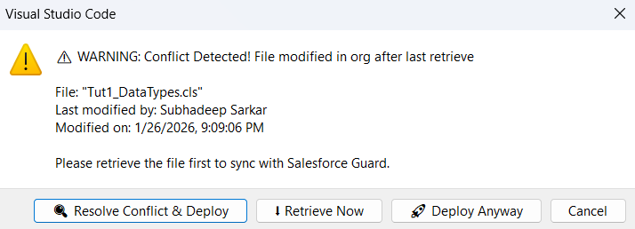
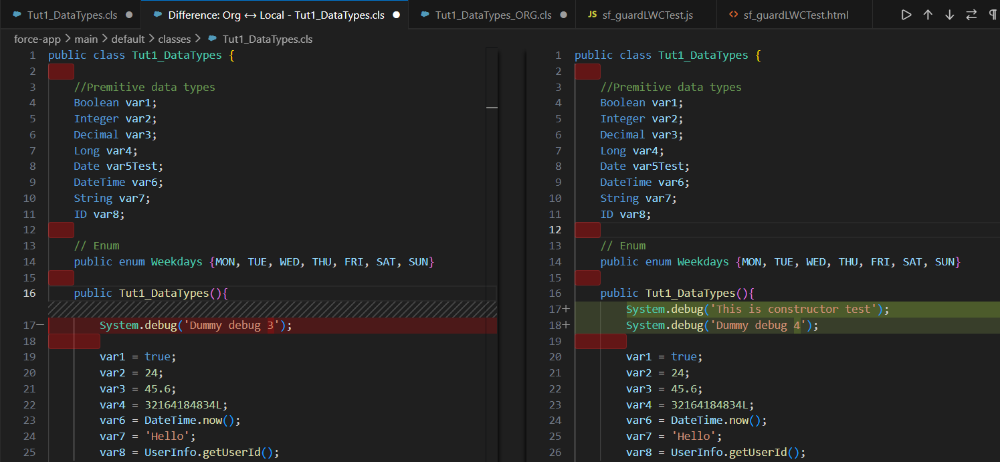

# Salesforce Deployment Guard 🛡️

> Stop overwriting your teammates' code! Detect conflicts before deployment and merge changes safely.

[](link-after-publishing)
[]()

## 🎯 The Problem

**Sound familiar?**

1. You retrieve `AccountController.cls` from your Dev org
2. Your teammate updates it (via Developer Console or their VS Code)
3. You deploy your version → **Their changes are gone!** 😱

This happens **every day** on Salesforce teams. Until now.

## ✨ The Solution

Salesforce Deployment Guard automatically detects conflicts before deployment and provides visual tools to safely merge changes.


*Automatic conflict detection before deployment*


*Side-by-side comparison with visual merge tools*

## 🚀 Features

- **🔍 Automatic Conflict Detection** - Checks if someone else modified the file before you deploy
- **📊 Visual Diff Viewer** - Side-by-side comparison of your changes vs. org version
- **⬇️ Tracked Retrieve** - Remembers when you last retrieved files to detect conflicts
- **🛡️ Safe Deploy** - Deploy with confidence knowing you won't overwrite others' work
- **⚡ Supports Apex & LWC** - Works with classes, triggers, and Lightning Web Components

## 📦 Installation

1. Open VS Code
2. Go to Extensions (`Ctrl+Shift+X`)
3. Search for **"Salesforce Deployment Guard"**
4. Click **Install**

**Requirements:**
- Salesforce CLI installed (`sf` or `sfdx`)
- Salesforce Extensions Pack for VS Code

## 🎓 How to Use

### Step 1: Retrieve Files (Tracked)

Right-click on any Apex or LWC file → **"SF Guard: Retrieve from Org"**

This retrieves the file AND marks it as synced with the org.

### Step 2: Make Your Changes

Edit the file as you normally would.

### Step 3: Deploy Safely

Right-click the file → **"SF Guard: Safe Deploy to Org"**

The extension will:
1. ✅ Check if anyone else modified the file since your last retrieve
2. ⚠️ Warn you if a conflict is detected
3. 📊 Show visual diff to resolve conflicts
4. 🚀 Deploy safely

## 🎬 Workflow Example

**Conflict Detected:**
```
⚠️ WARNING: Conflict Detected!

File: "AccountController.cls"
Last modified by: John Doe
Modified on: Jan 25, 2025, 2:30 PM

What would you like to do?
[🔍 Resolve Conflict & Deploy] [⬇️ Retrieve Now] [🚀 Deploy Anyway] [❌ Cancel]
```

**Choose "Resolve Conflict & Deploy":**
- Opens side-by-side diff viewer
- See exactly what changed
- Merge changes manually
- Deploy when ready

## ⚙️ Commands

| Command | Description |
|---------|-------------|
| `SF Guard: Retrieve from Org` | Retrieve file and track sync status |
| `SF Guard: Safe Deploy to Org` | Deploy with conflict detection |

## 📁 Supported File Types

| Type | Extensions | Conflict Detection | Diff Viewer |
|------|-----------|-------------------|-------------|
| Apex Classes | `.cls` | ✅ | ✅ |
| Apex Triggers | `.trigger` | ✅ | ✅ |
| Apex Pages | `.apex` | ✅ | ✅ |
| LWC Components | `.js`, `.html`, `.css` | ✅ | ✅ |

## 🆚 Why Use This Instead of Standard SFDX?

| Standard SFDX | Salesforce Deployment Guard |
|--------------|------------------------------|
| No conflict detection | ✅ Automatic conflict detection |
| Manual file comparison | ✅ Visual diff viewer |
| Risk of overwriting code | ✅ Prevents accidental overwrites |
| No deployment tracking | ✅ Tracks retrieve/deploy history |

## 🛠️ How It Works

1. **Tracks Retrievals** - Remembers when you last retrieved each file
2. **Queries Org** - Before deployment, checks file's `LastModifiedDate` in Salesforce
3. **Compares Timestamps** - If org version is newer than your last retrieve → Conflict!
4. **Shows Diff** - Retrieves org version and displays side-by-side comparison
5. **Safe Deploy** - You choose how to resolve, then deploy confidently

## 🐛 Known Limitations

- Only works with files (not entire metadata deployments)
- Requires Salesforce CLI to be installed and authenticated
- LWC conflict detection is at bundle level (all files in component)

## 📝 Roadmap

- [ ] Batch conflict checking (multiple files at once)
- [ ] Deployment history log
- [ ] Status bar indicators
- [ ] Team awareness features

## 🤝 Contributing

Found a bug? Have a feature request?

- **Report Issues**: [GitHub Issues](https://github.com/CR-Samrat/salesforce-deployment-guard/issues)
- **Suggest Features**: Open an issue with the "enhancement" label

## 📄 License

MIT License - See [LICENSE](LICENSE) file for details

## 👨‍💻 Author

Built with ❤️ by Subhadeep Sarkar

**If this extension saved you from a deployment disaster:**
- ⭐ Star the [GitHub repo](https://github.com/CR-Samrat/salesforce-deployment-guard)
- 📝 Leave a review on the marketplace
- 💬 Share with your Salesforce team!

## 🙏 Acknowledgments

Thanks to the Salesforce Developer community and everyone who provided feedback!

---

**Happy (Safe) Deploying!** 🚀