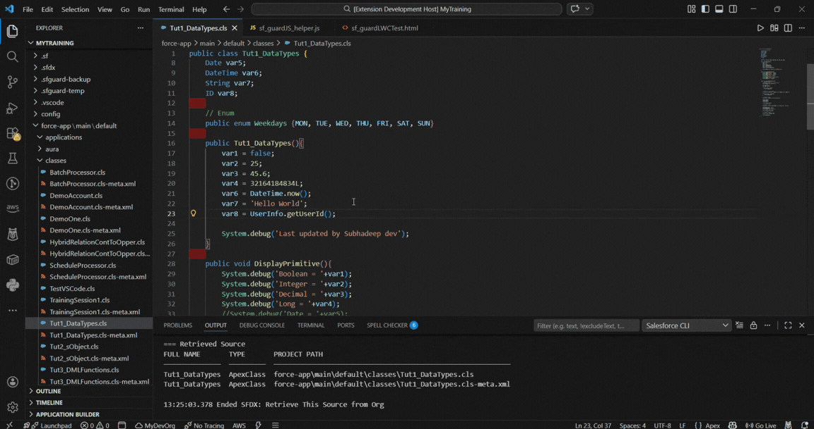
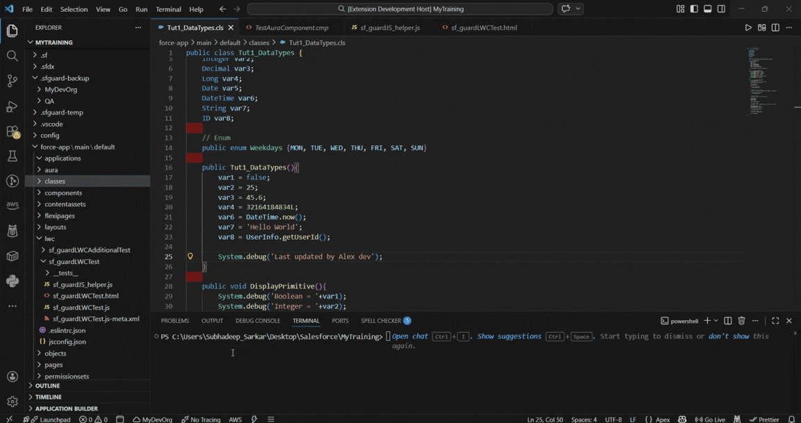
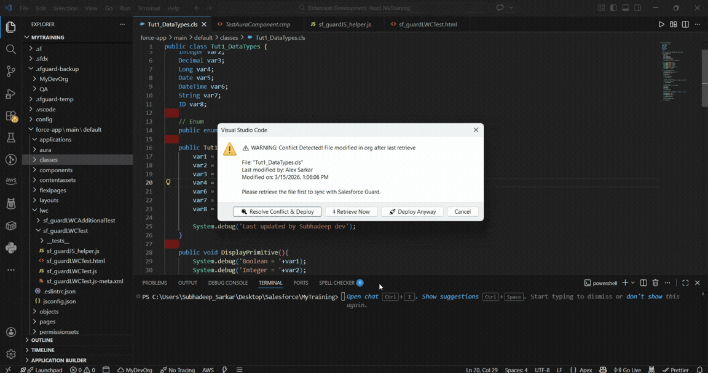
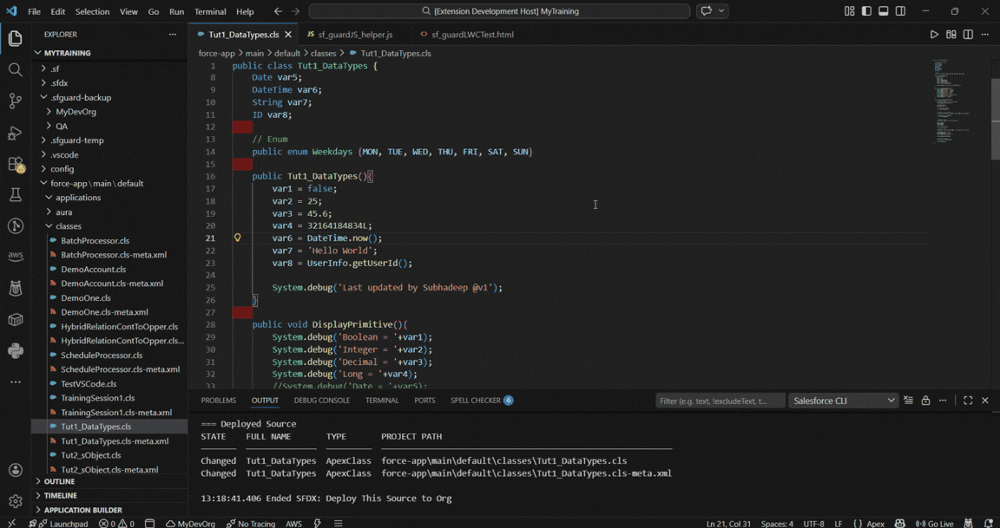
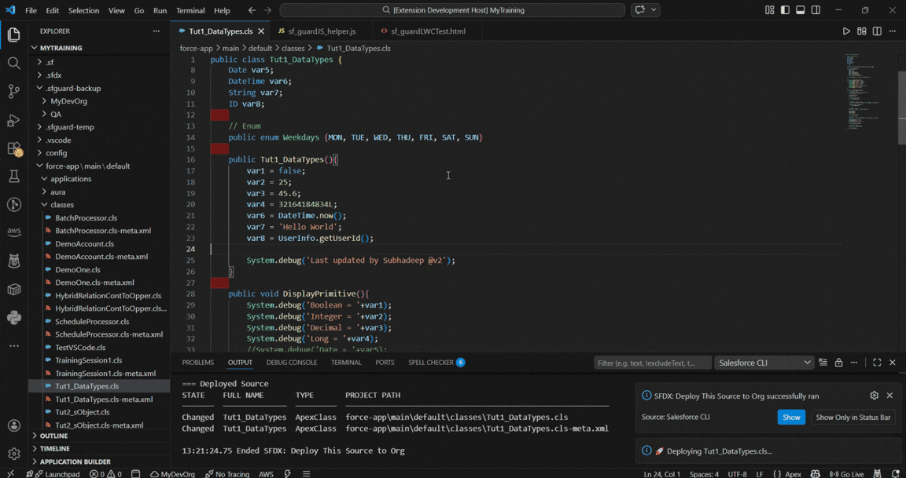
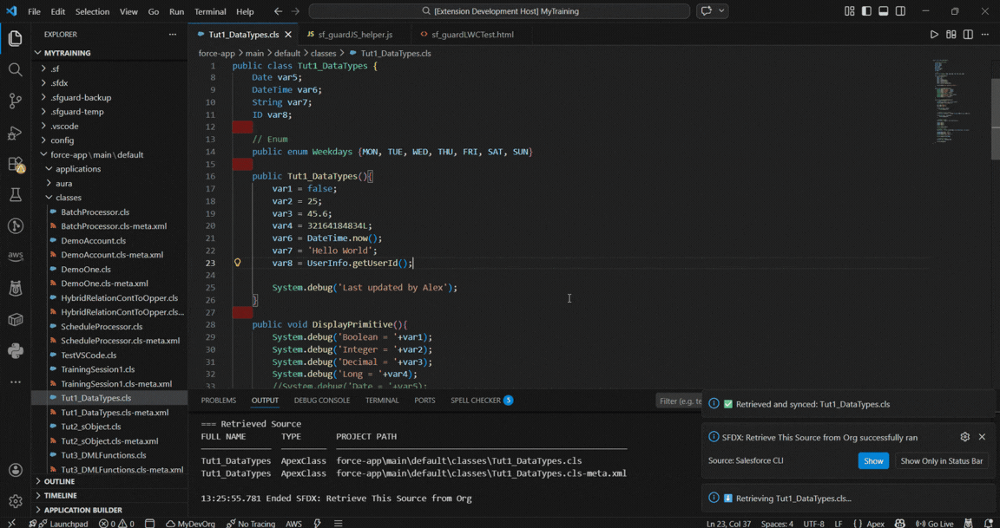

# Salesforce Deployment Guard 🛡️

> **Never lose code to accidental overwrites again.** Automatic conflict detection, backups, and recovery for Salesforce developers.

[](https://marketplace.visualstudio.com/items?itemName=SubhadeepDev.salesforce-deployment-guard)
[]()
[]()

---

## 🎯 The Problem Every Salesforce Developer Faces

**This happens every day:**

1. ✅ You retrieve `AccountController.cls` from Dev
2. ⏰ Your teammate updates it 10 minutes later
3. 🚀 You deploy your version
4. 💥 **Their changes vanish. Hours of work gone.**

**Or worse:**

1. 🔧 You spend hours building a feature
2. 🚀 Deploy successfully  
3. 😱 **Teammate accidentally overwrites it**
4. 😭 **No backup. No undo. Just... gone.**

### The Real Cost:
- ❌ Lost development time
- ❌ Frustrated teammates
- ❌ Broken features in production
- ❌ Emergency hotfixes
- ❌ Team tension

**SF Guard solves this. Completely.**

---

## ✨ The Solution

SF Guard is your safety net for Salesforce development:

✅ **Detects conflicts BEFORE deployment**  
✅ **Creates automatic backups** on every deploy  
✅ **Restores lost code** in seconds  
✅ **Works with all metadata types**  
✅ **100% free and open source**

---

## 🚀 Key Features

### 🔍 Conflict Detection
- Checks for changes BEFORE deployment
- Shows who modified the file and when
- Prevents accidental overwrites
- Works across all team members

### 📁 Automatic Backups (NEW in v0.5.0!)
- Backs up files automatically on deploy
- Stores up to 5 versions per file
- Organized by org and file type
- Zero configuration needed

### 📊 Visual Comparison
- Side-by-side diff viewer
- Syntax highlighting
- Inline change indicators
- One-click merge options

### 🔄 Easy Recovery
- Browse backup history
- Compare any backup with current version
- Restore in one click
- Works even if org version changed

### ⚡ Lightning Fast
- Cached connections (30-minute pool)
- Optimized queries
- Instant backup lookup
- Smart caching strategy

### 🎯 Complete Coverage
- ✅ Apex Classes & Triggers
- ✅ Lightning Web Components (LWC)
- ✅ Aura Components
- ✅ Visualforce Pages & Components
- ✅ All metadata files

---

## 📦 Installation

1. Open VS Code
2. Press `Ctrl+Shift+X` (or `Cmd+Shift+X` on Mac)
3. Search for **"Salesforce Deployment Guard"**
4. Click **Install**

**Requirements:**
- Salesforce CLI authentication available on your machine
- Authenticated Salesforce org

---

## 🎓 Complete Usage Guide

### 1. Retrieve File with Tracking



Right-click on any Salesforce file → **SF Guard: Retrieve from Org**. This retrieves the file and tracks it for conflict detection on future deployments.

---

### 2. Safe Deploy with Conflict Detection



Right-click file → **SF Guard: Safe Deploy to Org**. SF Guard checks for conflicts, creates a backup (if enabled), and deploys safely. If a conflict is detected, you'll see a warning with options to resolve.

---

### 2.5. SF Guard Output Panel

SF Guard includes its own output panel for deployment, retrieval, conflict detection, and detailed error logs. When an operation fails, the `SF Guard` output panel opens automatically so you can inspect the exact reason quickly.

---

### 3. View Differences



When a conflict is detected, the visual diff viewer opens automatically showing side-by-side comparison. Choose to merge manually, use org version, or keep your local changes.

---

### 4. Enable Automatic Backups



Right-click file → **SF Guard: Enable/Disable Backup for This File**. Once enabled, every deployment automatically creates a backup (up to 5 versions).

---

### 5. Compare & Restore Backups



Right-click file → **SF Guard: Compare with Backup**. Select from up to 5 previous versions, compare changes side-by-side, and restore with one click if needed.

---

### 6. View Sync Status



Command Palette → **SF Guard: View Sync Status**. See all tracked files, their last retrieve time, backup status, and manage them in one place.

---

## ⚙️ All Commands

| Command | Description |
|---------|-------------|
| `SF Guard: Safe Deploy to Org` | Deploy with automatic conflict detection and backup |
| `SF Guard: Retrieve from Org` | Retrieve file and track sync status |
| `SF Guard: Take Backup` | **NEW!** Create instant backup without deploying |
| `SF Guard: Compare with Backup` | View backup history and restore previous versions |
| `SF Guard: Enable/Disable Backup` | Toggle automatic backups for this file |
| `SF Guard: View Sync Status` | See all tracked files and their status |

---

## 📁 Supported File Types

| Type | Extensions | Conflict Check | Backup | Diff Viewer |
|------|-----------|----------------|--------|-------------|
| Apex Class | `.cls` | ✅ | ✅ | ✅ |
| Apex Trigger | `.trigger` | ✅ | ✅ | ✅ |
| Apex Page | `.apex` | ✅ | ✅ | ✅ |
| Visualforce Page | `.page` | ✅ | ✅ | ✅ |
| Visualforce Component | `.component` | ✅ | ✅ | ✅ |
| LWC JavaScript | `.js` | ✅ | ✅ | ✅ |
| LWC HTML | `.html` | ✅ | ✅ | ✅ |
| LWC CSS | `.css` | ✅ | ✅ | ✅ |
| Aura Component | `.cmp`, `.app`, `.evt`, `.intf` | ✅ | ✅ | ✅ |
| Aura Files | `.js`, `.css`, `.design`, `.svg`, `.auradoc`, `.tokens` | ✅ | ✅ | ✅ |
| Metadata Files | `.xml` | ✅ | ✅ | ✅ |

---

## 🆚 Why SF Guard vs Standard SFDX?

| Feature | Standard SFDX | SF Guard |
|---------|--------------|----------|
| Conflict Detection | ❌ None | ✅ Automatic before deploy |
| Automatic Backups | ❌ Manual only | ✅ Automatic on deploy |
| Diff Viewer | ❌ Manual comparison | ✅ Built-in visual diff |
| Restore Previous Version | ❌ Complex | ✅ One-click restore |
| Team Awareness | ❌ None | ✅ Shows who modified |
| Multi-org Support | ⚠️ Manual switching | ✅ Automatic org detection |
| Deployment Tracking | ❌ None | ✅ Tracks all deployments |
| Backup History | ❌ None | ✅ Up to 5 versions |

---

## 🛠️ How It Works

### Conflict Detection
1. User clicks "Safe Deploy"
2. SF Guard queries org for file's `LastModifiedDate`
3. Compares with your last retrieve timestamp
4. If newer → Conflict detected!
5. Shows diff viewer with resolution options
6. User chooses how to proceed
7. Deploys safely

### Automatic Backups
1. User enables backup for file (one-time)
2. On every deploy, SF Guard:
   - Creates timestamped backup folder
   - Saves current version before deployment
   - Keeps last 5 backups automatically
   - Deletes oldest if more than 5
3. Files stored in: `.sfguard-backup/{org}/{type}/{filename}/{timestamp}/`

### Backup Folder Structure
```
.sfguard-backup/
├── Dev/
│   ├── ApexClass/
│   │   └── AccountController/
│   │       ├── 2026-03-15T10-30-15-123Z/
│   │       │   ├── AccountController.cls
│   │       │   └── AccountController.cls-meta.xml
│   │       ├── 2026-03-15T09-20-45-456Z/
│   │       └── ... (up to 5 total)
│   └── LightningComponentBundle/
│       └── myComponent/
│           └── 2026-03-15T11-45-22-234Z/
│               ├── myComponent.js
│               ├── myComponent.html
│               ├── myComponent.css
│               └── myComponent.js-meta.xml
└── QA/
    └── ApexTrigger/
        └── ContactTrigger/
            └── ...
```

---

## 🎯 Real-World Scenarios

### Scenario 1: Teammate Overwrites Your Code

**Problem:** You deploy a feature. Teammate deploys later and overwrites it.

**Solution with SF Guard:**
1. Right-click file → **Compare with Backup**
2. Select your last deployment from the list
3. See exactly what was lost in the diff viewer
4. Click **Restore Backup**
5. Deploy again

**Time to recover: 10 seconds** ⚡

---

### Scenario 2: Conflict with In-Flight Changes

**Problem:** You're about to deploy but teammate just updated the file.

**Solution with SF Guard:**
1. Click **Safe Deploy**
2. SF Guard detects conflict automatically
3. Shows diff of both changes side-by-side
4. You merge both changes manually in the editor
5. Deploy combined version

**Result: Both developers' work preserved** ✅

---

### Scenario 3: Need to Compare Recent Changes

**Problem:** File has issues. Need to check what changed recently.

**Solution with SF Guard:**
1. Right-click → **Compare with Backup**
2. Browse all 5 recent versions with timestamps
3. Compare each with current version
4. Find the working version
5. Restore or cherry-pick specific changes

**Debugging made easy** 🔍

---

## 💡 Pro Tips

### Enable Backups for Critical Files
```
✅ AccountController.cls → Enable Backup
✅ ContactTrigger.trigger → Enable Backup
❌ TestClass.cls → Skip (not critical)
```

### Always Use Tracked Retrieve
```
✅ Use: SF Guard: Retrieve from Org
❌ Avoid: Standard SFDX retrieve (no tracking)
```

### Review Backups Before Major Deploys
Before deploying to production:
1. Compare with latest backup
2. Verify no unwanted changes included
3. Deploy with confidence

### Check Sync Status Regularly
Weekly routine:
- Command Palette → **View Sync Status**
- Review tracked files
- Clear old/unused entries

### Communicate with Your Team
Before deploying shared files:
- "⚠️ Deploying AccountController in 5 mins"
- Gives teammates time to sync or alert you

---

## 🐛 Troubleshooting

### "No active Salesforce org" Error

```bash
# Check authentication
sf org list

# Re-authenticate if needed
sf org login web -a Dev
```

### Backup Not Creating

**Check:**
1. Is backup enabled for this file?
   - Right-click → Enable/Disable Backup
2. Is file a supported Salesforce type?
3. Check console logs:
   - Help → Toggle Developer Tools → Console tab

### Diff Viewer Not Opening

**Try:**
1. Close VS Code completely
2. Reopen workspace
3. Try operation again

### Conflict Detection Not Working

**Ensure:**
1. File was retrieved using **SF Guard: Retrieve from Org**
2. You're connected to the correct org
3. File exists in the org

---

## 🔒 Privacy & Security

- ✅ **All data stored locally** - Never sent to external servers
- ✅ **Uses your SF CLI auth** - No separate credentials needed
- ✅ **Backups in your workspace** - Under your complete control
- ✅ **Open source** - [Audit the code](https://github.com/CR-Samrat/salesforce-deployment-guard) anytime
- ✅ **No tracking or analytics** - Your work stays private

---

## 📊 What Users Are Saying

**After 30 Days of Using SF Guard:**

```
✅ Conflicts Detected: 127
✅ Accidental Overwrites Prevented: 43
✅ Code Restored from Backup: 28
✅ Hours Saved: ~50
✅ Team Frustration: Eliminated
```

> "SF Guard has saved my team countless hours. The automatic backups alone are worth it. We've caught so many conflicts before they became problems."  
> — *Sarah M., Lead Salesforce Developer*

---

## 🗺️ Roadmap

### v0.6.0 (Planned)
- Batch deployment with conflict check
- Deployment history dashboard
- Custom backup retention rules
- Backup annotations and notes

### v1.0.0 (Future)
- AI-powered merge suggestions
- Team collaboration features
- Deployment analytics
- Slack/Teams notifications

**Have a feature request?** [Open an issue](https://github.com/CR-Samrat/salesforce-deployment-guard/issues)

---

## 🤝 Contributing

### Report Bugs
[Open an issue](https://github.com/CR-Samrat/salesforce-deployment-guard/issues) with:
- What you were doing
- What happened vs. what you expected
- Screenshots or error messages
- Your VS Code and extension versions

### Suggest Features
[Open an enhancement request](https://github.com/CR-Samrat/salesforce-deployment-guard/issues/new)

### Spread the Word
- ⭐ [Star on GitHub](https://github.com/CR-Samrat/salesforce-deployment-guard)
- 📝 Leave a marketplace review
- 💬 Share with your team
- 🐦 Tweet about it

---

## 📄 License

MIT License - Free forever, no restrictions.

See [LICENSE](LICENSE) file for details.

---

## 👨‍💻 About

**Built with ❤️ by Subhadeep Sarkar**

Salesforce developer who got tired of losing code to deployment conflicts. Built SF Guard to solve this problem for the entire community.

**Connect:**
- [GitHub](https://github.com/CR-Samrat)
- [LinkedIn](https://linkedin.com/in/subhadeep-sarkar)

---

## 🙏 Acknowledgments

Thanks to the Salesforce Developer community and everyone who provided feedback, suggestions, and support!

---

## 📞 Support

**Need help?**
- 📖 [Full Documentation](https://github.com/CR-Samrat/salesforce-deployment-guard#readme)
- 🐛 [Report Issues](https://github.com/CR-Samrat/salesforce-deployment-guard/issues)
- 💬 [Discussions](https://github.com/CR-Samrat/salesforce-deployment-guard/discussions)

---

## ⭐ Show Your Support

**If SF Guard saved you from a deployment disaster:**

- ⭐ [Star the repo](https://github.com/CR-Samrat/salesforce-deployment-guard)
- 📝 Leave a marketplace review
- 💬 Share with your team
- 🐦 Tweet about it

---

**Happy (Safe) Deploying!** 🚀

*Never lose code to overwrites again.*
